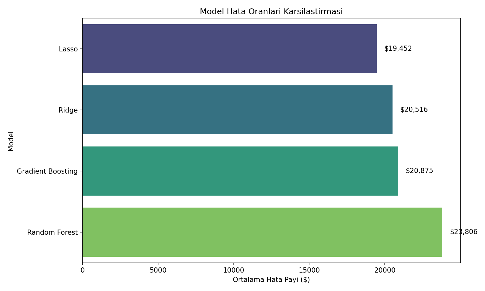
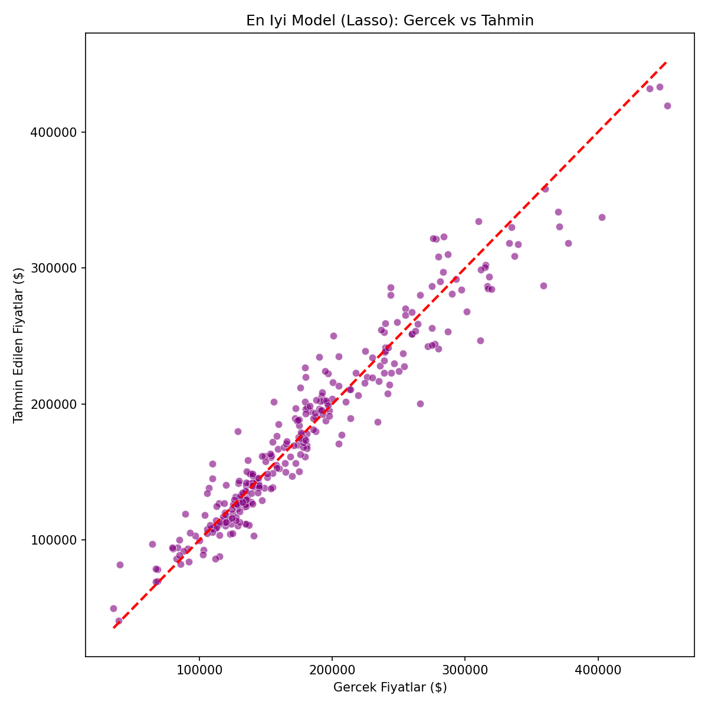
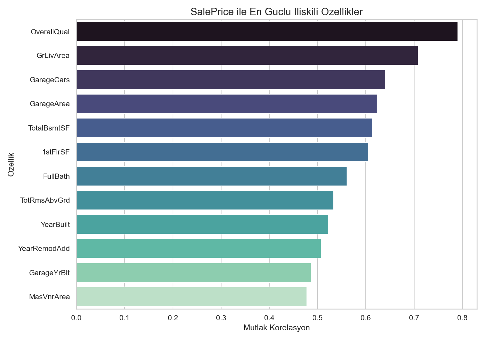

# Ev Fiyat Tahminleme Modeli

Bu proje, Ames Housing veri setindeki konut özelliklerini kullanarak ev satış fiyatlarını tahmin etmek için hazırlanmış uçtan uca bir makine öğrenmesi çalışmasıdır. Çalışma; veri keşfi, eksik değer yönetimi, aykırı değer temizliği, özellik mühendisliği, model karşılaştırması ve test seti için tahmin üretimi adımlarını içerir.

## Proje Özeti

- **Problem:** Konut özelliklerinden `SalePrice` değerini tahmin etmek.
- **Veri seti:** Ames Housing, 79 açıklayıcı değişken.
- **Eğitim verisi:** 1.460 satır, 81 sütun.
- **Test verisi:** 1.459 satır, 80 sütun.
- **Ön işleme sonrası:** 1.458 eğitim satırı ve 250 model özelliği.
- **En iyi model:** Lasso Regression.
- **Doğrulama performansı:** RMSE = **$19,451.82**, RMSLE = **0.1141**, R2 = **0.9227**.

## Proje Yapısı

```text
.
|-- data/
|   |-- raw/                  # Ham train/test verileri ve veri açıklaması
|   `-- processed/            # Modellemeye hazır işlenmiş veri setleri
|-- docs/                     # Ek dokümanlar ve sunum materyalleri
|-- outputs/
|   |-- figures/              # EDA ve model sonuç grafikleri
|   `-- results/              # Raporlar, model skorları ve tahmin dosyaları
|-- src/
|   |-- 01_ilk_bakis.py
|   |-- 02_kesifsel_veri_analizi.py
|   |-- 03_on_isleme.py
|   `-- 04_model_egitimi.py
|-- requirements.txt
`-- README.md
```

## Kullanılan Yöntem

1. **İlk veri inceleme:** Satır/sütun sayıları, veri tipleri, eksik değerler ve istatistiksel özet çıkarıldı.
2. **Keşifsel veri analizi:** Hedef değişken dağılımı, log dönüşüm etkisi, korelasyonlar ve önemli özellikler görselleştirildi.
3. **Ön işleme:** Eksik değerler değişken anlamına göre dolduruldu, aykırı değerler temizlendi, `SalePrice` için `log1p` dönüşümü uygulandı.
4. **Özellik mühendisliği:** Sıralı kategoriler sayısallaştırıldı, nominal kategoriler one-hot encoding ile dönüştürüldü, çarpık sayısal değişkenlere log dönüşümü uygulandı.
5. **Modelleme:** Ridge, Lasso, Random Forest ve Gradient Boosting modelleri karşılaştırıldı.
6. **Çıktı üretimi:** Model skorları, grafikler, en iyi model özeti ve test seti tahminleri kaydedildi.

## Model Sonuçları

Sonuçlar, `random_state=42` ile yapılan %80 eğitim / %20 doğrulama ayrımı üzerinden hesaplandı.

| Model | RMSE ($) | RMSLE | R2 Score |
|---|---:|---:|---:|
| Lasso | 19,451.82 | 0.1141 | 0.9227 |
| Ridge | 20,516.11 | 0.1209 | 0.9133 |
| Gradient Boosting | 20,875.15 | 0.1182 | 0.9171 |
| Random Forest | 23,805.79 | 0.1427 | 0.8793 |

Lasso modeli doğrulama setinde en düşük RMSE değerini verdi. Bu sonuç, düzenlileştirilmiş doğrusal yaklaşımın bu veri setinde hem güçlü hem de genellenebilir bir tahmin performansı sunduğunu gösteriyor.

## Görsel Çıktılar

### Model Karşılaştırması



### En İyi Model: Gerçek vs Tahmin



### En Önemli Korelasyonlar



## Öne Çıkan Bulgular

- Satış fiyatı sağa çarpık dağıldığı için hedef değişkende log dönüşümü model performansını iyileştirdi.
- `GrLivArea` değeri çok yüksek olup satış fiyatı düşük olan 2 aykırı satır eğitim verisinden çıkarıldı.
- Satış fiyatıyla en güçlü ilişkili değişkenler arasında `OverallQual`, `GrLivArea`, `GarageCars`, `GarageArea` ve `TotalBsmtSF` yer aldı.
- Lasso modeli, gereksiz veya zayıf etkili değişkenleri baskılayarak en iyi doğrulama hatasına ulaştı.

## Çıktı Dosyaları

- `outputs/results/model_results.csv`: Tüm modellerin RMSE, RMSLE ve R2 skorları.
- `outputs/results/best_model_summary.md`: En iyi modelin kısa performans özeti.
- `outputs/results/test_predictions.csv`: Test seti için üretilen fiyat tahminleri.
- `outputs/results/preprocessing_summary.md`: Ön işleme adımının özeti.
- `outputs/figures/`: EDA ve modelleme grafiklerinin tamamı.

## Kurulum

```bash
pip install -r requirements.txt
```

İsteğe bağlı olarak sanal ortam kullanabilirsiniz:

```bash
python -m venv .venv
.\.venv\Scripts\activate
pip install -r requirements.txt
```

## Çalıştırma

Tüm akışı baştan üretmek için komutları sırayla çalıştırın:

```bash
python src/01_ilk_bakis.py
python src/02_kesifsel_veri_analizi.py
python src/03_on_isleme.py
python src/04_model_egitimi.py
```

Bu komutlardan sonra güncel grafikler `outputs/figures/`, model skorları ve tahmin dosyaları ise `outputs/results/` altında oluşur.

## Geliştirme Notları

Bir sonraki iyileştirme adımı olarak çapraz doğrulama, hiperparametre optimizasyonu ve daha güçlü boosting modelleri denenebilir. Ayrıca modelin üretim kullanımına yaklaşması için eğitim hattı tek bir pipeline yapısına alınabilir.
